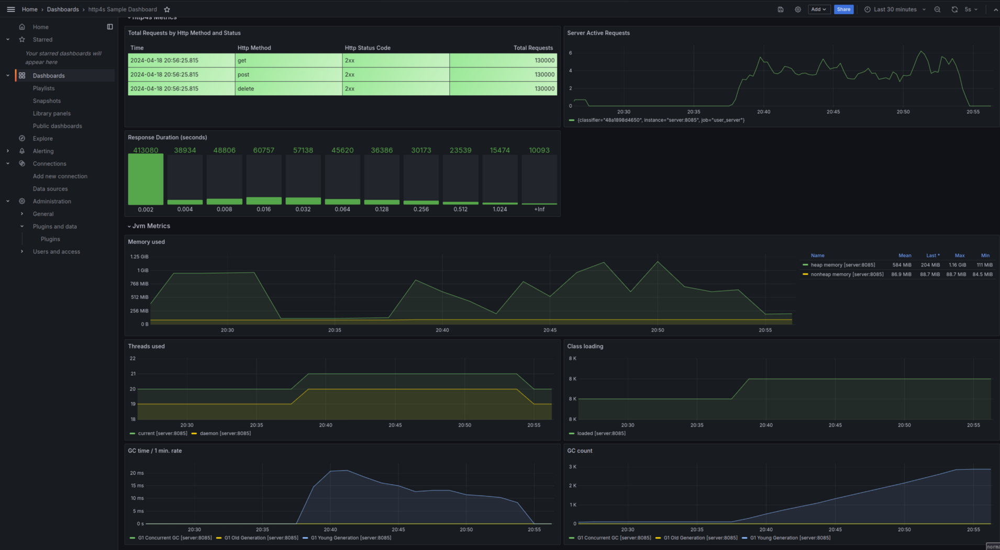
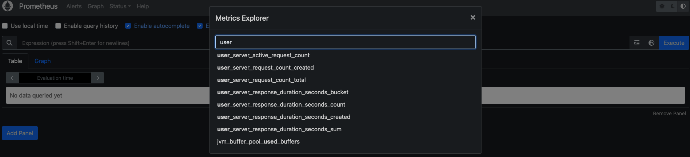
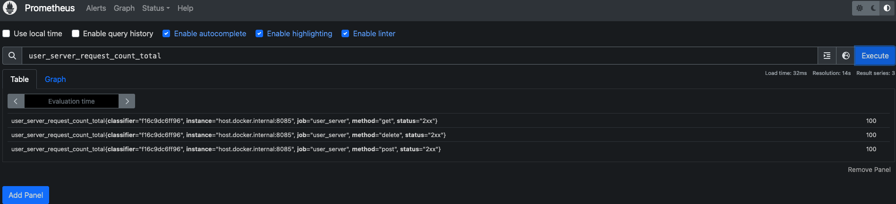
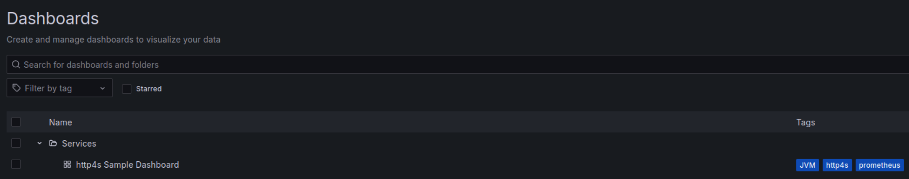

# http4s Prometheus Monitoring Example



## Summary
This project contains a simple http4s server (and corresponding client to exercise the server). 
The server includes the [http4s Prometheus ](https://github.com/http4s/http4s-prometheus-metrics) library and therefore 
exposes a `/metrics` endpoint that can be scraped by Prometheus.

There is a [docker-compose](docker-compose.yml) file in this project that will create three docker containers: -

1. An instance of the http4s user_server.
2. A Prometheus instance that is configured to scrape the metrics from the server's metrics endpoint.
3. An instance of Grafana that is already provisioned to ingest the metrics from Prometheus to display the sample dashboard above.

## Requirements
The following is required to run this project on your local machine: -

| Requirement                       | Version |
|-----------------------------------|---------|
 | JDK                               | version >= 17 |
| [sbt](https://www.scala-sbt.org/) | 1.9.9 |
| docker |  >= 26.0.x |
| docker-compose | >= 1.29.x |
| git | any |


# Setup Guide

## Build and run docker containers
1. Clone this repo to your local machine.
2. Run the following `docker-compose` command to build the server image and the Prometheus and Grafana instances: -

```
docker-compose up --build -d
```

This will take a while on first run, as docker will download all the required dependencies. Once done, you should have the 
following output when running `docker-compose ps`

```
docker-compose ps
           Name                         Command               State                    Ports                  
--------------------------------------------------------------------------------------------------------------
grafana                      /run.sh                          Up      0.0.0.0:3000->3000/tcp,:::3000->3000/tcp
http4s-prometheus_server_1   java -jar server.jar             Up      0.0.0.0:8085->8085/tcp,:::8085->8085/tcp
prometheus                   /bin/prometheus --config.f ...   Up      0.0.0.0:9090->9090/tcp,:::9090->9090/tcp
```

## Check Metrics are being scraped by Prometheus

Prometheus should be running on `http://localhost:9090`.

In the Prometheus UI, use the metrics explorer to confirm metrics prefixed `user_server` are being imported: -






## Setup Grafana
 
Grafana should be running on `http://localhost:3000`.

Login to Grafana using userid `admin` and password `admin` - you will need to change your password on first access.

The Prometheus data source and a sample dashboard is already provisioned.

The dashboard is accessible under services in the dashboards menu: -



### Run the User Client to generate some metrics
The user client is run outside of docker and can be run from your IDE or via sbt as follows: -

```
sbt
1:12 $ sbt                                                                                                                                                                                                                                             
[info] welcome to sbt 1.9.9 (GraalVM Community Java 21.0.2)                                                                                                                                                                                             
[info] loading settings for project http4s-prometheus-build from plugins.sbt ...                                                                                                                                                                        
[info] loading project definition from /home/martinr/Projects/github/http4s-prometheus/project                                                                                                                                                          
[info] loading settings for project root from build.sbt ...                                                                                                                                                                                             
[info] set current project to Http4s Prometheus monitoring example (in build file:/home/martinr/Projects/github/http4s-prometheus/)                                                                                                                     
[info] sbt server started at local:///home/martinr/.sbt/1.0/server/3cbba8331debd9bf664f/sock                                                                                                                                                            
[info] started sbt server                                                                                                                                                                                                                               
sbt:Http4s Prometheus monitoring example> project client                                                                                                                                                                                                
[info] set current project to client (in build file:/home/martinr/Projects/github/http4s-prometheus/)                                                                                                                                                   
sbt:client>   
sbt:client> run
[info] running (fork) net.martinprobson.example.client.UserClient 
[info] 2024-04-18 21:28:29.154 INFO  [io-compute-3] n.m.e.c.UserClient - call User(5,User-5,Email-5)
[info] 2024-04-18 21:28:29.154 INFO  [io-compute-0] n.m.e.c.UserClient - call User(8,User-8,Email-8)
[info] 2024-04-18 21:28:29.155 INFO  [io-compute-8] n.m.e.c.UserClient - call User(10,User-10,Email-10)
[info] 2024-04-18 21:28:29.154 INFO  [io-compute-4] n.m.e.c.UserClient - call User(6,User-6,Email-6)
[info] 2024-04-18 21:28:29.154 INFO  [io-compute-11] n.m.e.c.UserClient - call User(7,User-7,Email-7)
[info] 2024-04-18 21:28:29.154 INFO  [io-compute-6] n.m.e.c.UserClient - call User(3,User-3,Email-3)
[info] 2024-04-18 21:28:29.154 INFO  [io-compute-5] n.m.e.c.UserClient - call User(2,User-2,Email-2)
[info] 2024-04-18 21:28:29.154 INFO  [io-compute-1] n.m.e.c.UserClient - call User(1,User-1,Email-1)
[info] 2024-04-18 21:28:29.154 INFO  [io-compute-2] n.m.e.c.UserClient - call User(4,User-4,Email-4)
[info] 2024-04-18 21:28:29.154 INFO  [io-compute-9] n.m.e.c.UserClient - call User(9,User-9,Email-9)
[info] 2024-04-18 21:28:29.592 INFO  [io-compute-4] n.m.e.c.UserClient - GetUser - 130015
[info] 2024-04-18 21:28:29.593 INFO  [io-compute-5] n.m.e.c.UserClient - delete id 130015
[info] 2024-04-18 21:28:29.594 INFO  [io-compute-9] n.m.e.c.UserClient - GetUser - 130012
[info] 2024-04-18 21:28:29.595 INFO  [io-compute-3] n.m.e.c.UserClient - delete id 130012
[info] 2024-04-18 21:28:29.596 INFO  [io-compute-8] n.m.e.c.UserClient - GetUser - 130011
[info] 2024-04-18 21:28:29.596 INFO  [io-compute-8] n.m.e.c.UserClient - delete id 130011
[info] 2024-04-18 21:28:29.596 INFO  [io-compute-11] n.m.e.c.UserClient - GetUser - 130018
[info] 2024-04-18 21:28:29.598 INFO  [io-compute-11] n.m.e.c.UserClient - delete id 130018
[info] 2024-04-18 21:28:29.598 INFO  [io-compute-6] n.m.e.c.UserClient - GetUser - 130020
[info] 2024-04-18 21:28:29.599 INFO  [io-compute-3] n.m.e.c.UserClient - delete id 130020
[info] 2024-04-18 21:28:29.599 INFO  [io-compute-2] n.m.e.c.UserClient - GetUser - 130014
[info] 2024-04-18 21:28:29.600 INFO  [io-compute-2] n.m.e.c.UserClient - delete id 130014
[info] 2024-04-18 21:28:29.601 INFO  [io-compute-9] n.m.e.c.UserClient - GetUser - 130017
[info] 2024-04-18 21:28:29.602 INFO  [io-compute-9] n.m.e.c.UserClient - delete id 130017
[info] 2024-04-18 21:28:29.602 INFO  [io-compute-1] n.m.e.c.UserClient - GetUser - 130016
[info] 2024-04-18 21:28:29.603 INFO  [io-compute-1] n.m.e.c.UserClient - delete id 130016
[info] 2024-04-18 21:28:29.603 INFO  [io-compute-0] n.m.e.c.UserClient - GetUser - 130019
[info] 2024-04-18 21:28:29.603 INFO  [io-compute-0] n.m.e.c.UserClient - delete id 130019
[info] 2024-04-18 21:28:29.605 INFO  [io-compute-11] n.m.e.c.UserClient - GetUser - 130013
[info] 2024-04-18 21:28:29.605 INFO  [io-compute-1] n.m.e.c.UserClient - delete id 130013
[info] 2024-04-18 21:28:29.614 INFO  [io-compute-3] n.m.e.c.UserClient - Shutdown of EmberClient
[success] Total time: 2 s, completed 18 Apr 2024, 21:28:29
```


# Technical Details

## Number of Requests performed by Client
The number of requests performed by the client is controlled by the size of the Users stream created on this line in 
[UserClient.scala](/client/src/main/scala/net/martinprobson/example/client/UserClient.scala):- 

```scala
  /** Main entry point for our client program, call our program with an in
    * memory generated stream of Users
    */
  override def run: IO[Unit] = program(MemorySource(1000).stream)
```

## Metrics Prefix/Histogram buckets
All the metrics are prefixed `user_server` because of the override prefix passed into the metrics setup method.

We also override the default histogram buckets for the response time (as this is just a simple setup, we can reduce the duration
buckets from the defaults).

```scala
 /**
   * Define a meteredRouter which acts as a wrapper for our UserService.
   * <p>It sets up a metrics service and attaches it to the "/" endpoint.</p>
   * Note that:- <ol>
   *   <li>We wrap the UserService with a Metrics[IO] to actually collect the metrics.</li>
   *   <li>We define our own histogram buckets (for response times) as the defaults
   *   are too large for this simple service (that is just backed by an in-memory database).</li>
   *   </ol>
   * @param userService The original User service that we are collecting metrics for
   * @param classifier A classifier for the Prometheus labels (in this case, we are using the hostname)
   * @return A Resource[IO, HttpRoutes] - Our UserService and Metrics wrapped in a Resource.
   */
  private def meteredRouter(userService: HttpRoutes[IO], classifier: String): Resource[IO, HttpRoutes[IO]] = for {
    metricsService <- PrometheusExportService.build[IO]
    metrics <- Prometheus.metricsOps[IO](
      metricsService.collectorRegistry,
      "user_server",
      responseDurationSecondsHistogramBuckets = NonEmptyList(.002, List(0.004, 0.008, 0.016, 0.032, 0.064, 0.128, 0.256, 0.512, 1.024))
    )
    router = Router[IO](
      "/api" -> Metrics[IO](ops = metrics, classifierF = (_: Request[IO]) => Some(classifier))(
        userService
      ),
      "/" -> metricsService.routes
    )
  } yield router
```
The following libraries are used for this project

| Library                                           | Description                                   |
|---------------------------------------------------|-----------------------------------------------|
| [CATS](https://typelevel.org/cats/)               | Functional programming abstractions in Scala  |
| [CATS Effect](https://typelevel.org/cats-effect/) | Pure asynchronous runtime for Scala           |
| [fs2](https://fs2.io/#/)                          | Functional streams for Scala                  |
| [http4s](https://http4s.org)                      | Typeful, functional, streaming http for Scala |
| [Circe](https://circe.github.io/circe/)           | A Json library for Scala powered by CATS      |

The project is configured as separate sbt sub-modules as follows: -

| Project | Description                                                                                                                                              |
|---------|----------------------------------------------------------------------------------------------------------------------------------------------------------|
| root    | The root module that aggregates the separate sub-modules below                                                                                           |
| common  | Common code shared between all sub-modules (e.g. configuration, logging and the `User` model.                                                            |
| Server  | Simple http4s server that accepts requests to post/get/delete `User` objects to a backend database (just an in memory db in this case for demo purpose). |
| Client  | http4s client that generates some user objects and posts/gets and deletes to the server endpoint(s) above                                                |  

The structure and main classes of each sub-module are described below.

## Server Project
[UserServer](server/src/main/scala/net/martinprobson/example/server/UserServer.scala) builds a http4s server with a `UserService` that responds to the following endpoints: -

| Http Method | Endpoint                         | Description                                                 |
|------------|----------------------------------|-------------------------------------------------------------|
| POST       | /user                            | Post the user defined in the request to the user repository |
| GET        | /users/count                     | Return a count of all users                                 |
| GET        | /user/{id}                       | Return user defined by id or Http status 404 if not found   |
| DELETE     | /user/{id}                       | Deletes a user or Http status 404 if not found              |

### UserRepository
The [UserRepository](server/src/main/scala/net/martinprobson/example/server/db/repository/UserRepository.scala) defines the interface
methods for the user repository. This interface is implemented by: -
* [InMemoryUserRepository](server/src/main/scala/net/martinprobson/example/server/db/repository/InMemoryUserRepository.scala) - Holds the users in a simple in memory Map guarded by a Cats `Ref`.

## Client Project
[UserClient](client/src/main/scala/net/martinprobson/example/client/UserClient.scala) builds a http4s client that uses an in memory stream of users and posts/gets and deletes them to the server (in parallel).

## Common Project
Holds common code shared between projects above, just the user object and resource files.

